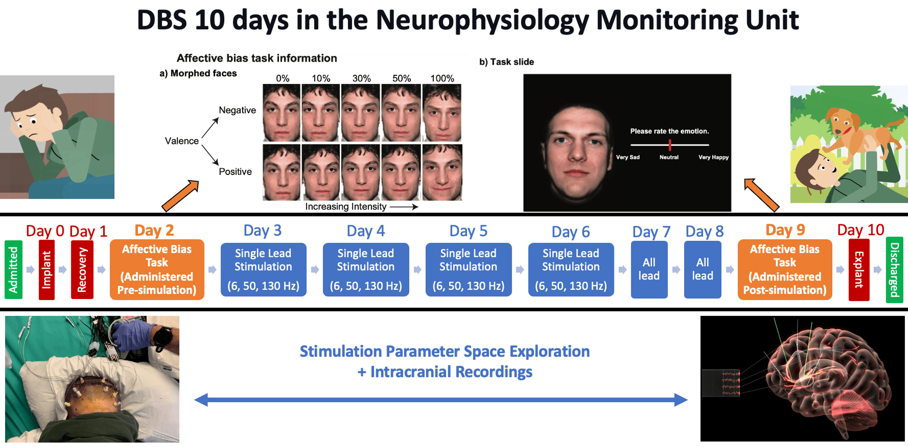
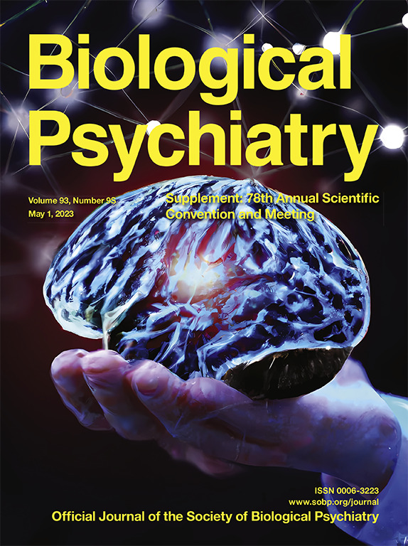
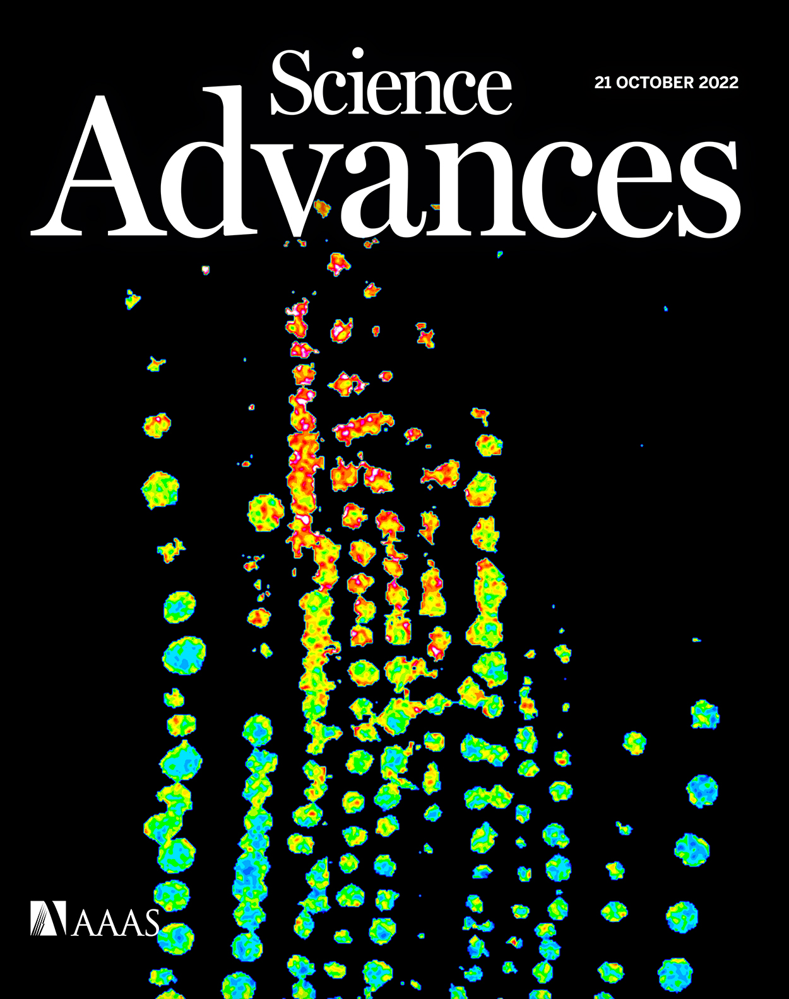

# Portfolio
---
## Baylor College of Medicine Postbaccalaureate Research Education Program (PREP)
### Affective Bias and Electrophysiology as Biomarkers of Treatment Resistant Depression 

Designed and implemented a year-long clinical research project in [Dr. Kelly Bijanki's Neurosurgery lab](https://www.bcm.edu/research/faculty-labs/kelly-bijanki-lab), focusing on studying the covariance of depression symptom severity with electroencephalogram (sEEG) recordings. [Baylor College of Medicine Postbaccalaureate Research Education Program (PREP)](https://www.bcm.edu/education/graduate-school-of-biomedical-sciences/programs/diversity/postbaccalaureate-research-education-program-prep).
 

 

---
## Undergraduate Projects 
### Biomedical Genomics 
#### Replicate Results Using a Raw Data Set Produced by Primary Research Paper

I obtained a raw data set used in the research paper. This data set served as the foundation for my exploration and analysis. With access to the raw data, I aimed to replicate specific findings and heat maps presented in the original study using my data analysis and programming skills. I leveraged the power of R; specifically, I chose R Markdown to structure my project. The primary objective of my capstone project was to accurately reproduce the results featured in the research paper using  R programming, data manipulation, and statistical analysis.

 

 

---
### Relational Databases and SQL
#### Covid-19 Vaccinations in US Data

My project focused on leveraging SQL and relational databases to analyze and present COVID-related data, with a specific emphasis on the United States. As the COVID vaccine became available, copious amounts of data were collected, including vaccination rates, the number of vaccinated individuals, and the impact of vaccine rollout on COVID's decline. Recognizing the varying perceptions and misunderstandings about COVID's global impact, I aimed to provide accurate and accessible data to a worldwide audience. 

 

 

---
### Practical Unix Programming
#### Gene Codon Sequence

I have created a Python program capable of processing DNA files specified via command-line arguments. The program ensures that the DNA file contains only valid DNA strings with no extraneous characters, and it terminates if any inconsistencies are detected. Additionally, it performs a check to ensure the number of characters is a multiple of three when ending with a newline character (or a multiple of three plus one otherwise). The program handles both directions of the coding strand and reports the codon sequence from the starting codon 'atg' to one of the three stop codons (taa, tag, or tga). It provides information about the number of codons and the total bases in the transcript. If the DNA file lacks a valid gene codon sequence in both directions, the program notifies the user accordingly.

 

 

#### Phylogenetics: Compare DNA of Microrganisms

My project involved creating adaptable code capable of processing genomic sequences (DNA/RNA) saved in separate files. The code reads these files as command-line arguments ($1 and $2) and arranges the data from horizontal to vertical for accurate comparison. Using the Unix cmp command, the code compares the two files, allowing researchers to identify discrepancies or similarities between different sets of genomic sequences. The flexibility of the code makes it valuable for various genetic research applications, promoting data-driven insights and advancing genetic analysis.

 

 

---
### Computational Molecular Biology

This section highlights my accomplishments during the computational molecular biology class. The course offered a comprehensive exploration of neural networks and their applications in deciphering complex biological data. I gained proficiency in implementing and optimizing neural network algorithms, enabling me to manipulate large datasets and extract valuable insights. The class also fostered a deep appreciation for the fusion of biology and computation, opening new possibilities in genomics, drug discovery, and personalized medicine. I am enthusiastic about applying this knowledge to drive innovation and further contribute to the field of computational molecular biology.

 

 

---
## Publications

As a Student Researcher at the Icahn School of Medicine in Dr. Eric Nestler's Lab, I conducted research on the connection between pathological aggression and reward circuits in the brain. Using mouse models, I performed behavioral testing sessions to study emotion processing in complex decision-making related to aggressive behaviors. The research aimed to understand how maladaptive reinforcement of aggression occurs which lead to a publication and coauthorship in Biological Psychiatry and Science.

 
[***Linking Brain-Wide Activity Patterns During Neuroeconomic Decision Making to Aggression***](https://www.biologicalpsychiatryjournal.com/article/S0006-3223(23)00338-4/fulltext)

 
[***Distinct forms of regret linked to resilience versus susceptibility to stress are regulated by region-specific CREB function in mice***](https://www.science.org/doi/10.1126/sciadv.add5579)

 

---

© 2023 Salma Elhassa. Powered by Jekyll and the Minimal Theme.
